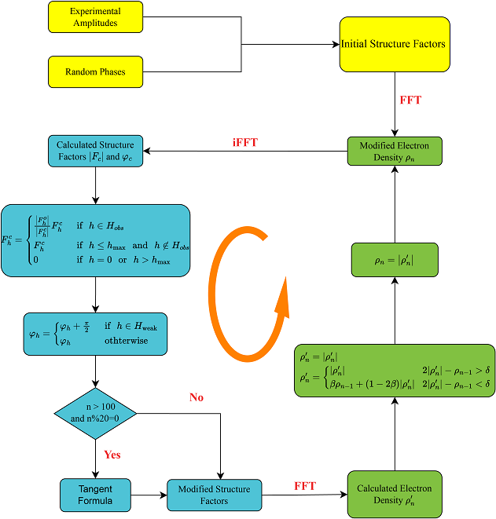

# A Modified Phase-retrieval Algorithm
  A modified phase-retrieval algorithm, incorporating the π-half variant of charge flipping algorithm and direct-methods tangent formula into the relaxed alternating averaged reflection phase-retrieval (RAAR) algorithm, has been developed for the determination of anomalously scattering substructures from single-wavelength anomalous diffraction (SAD) data of macromolecules. 

## Requirement
- Fortran90
- Linux operating system
- [fgsl/gsl](http://www.gnu.org/software/gsl/) for random number generation
- [FFTW3](http://www.fftw.org) library for the fast Fourier transform
- CCP4 subroutine libraries for basic crystallographic operations

## The dual-space iterative framework of the  Modified Phase-retrieval Algorithm

